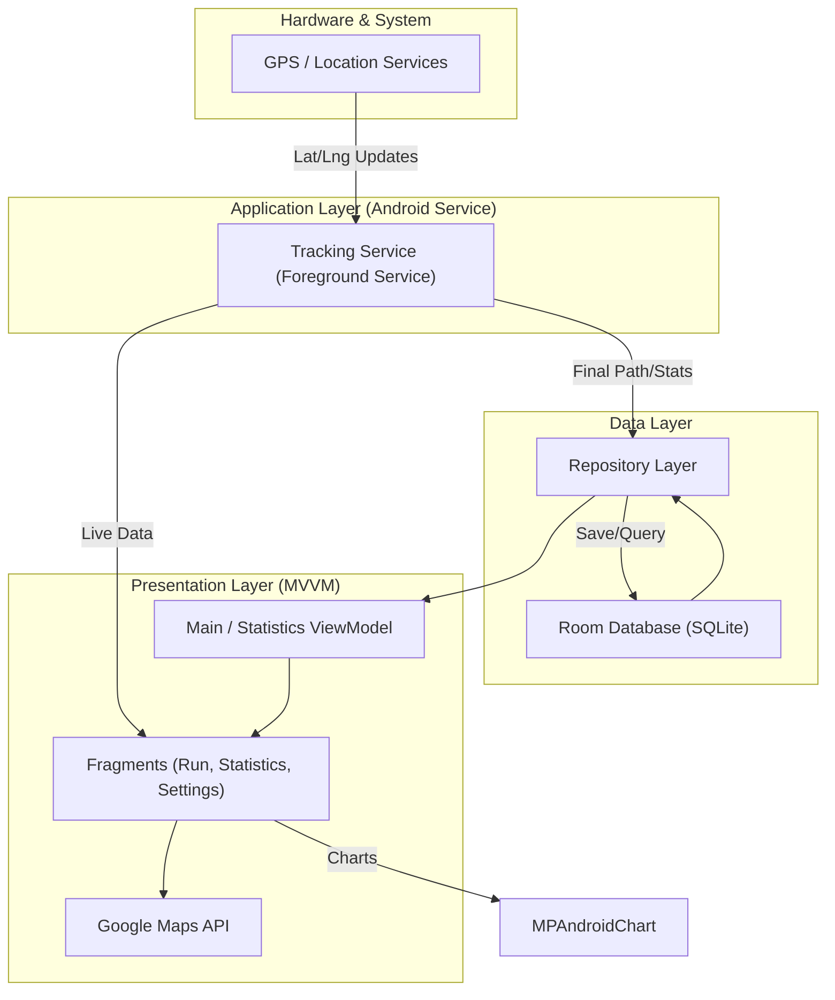

# Health_Coach
Tech Stack: Kotlin, Android, Room- SQLite Running Tracker application can track the realtime runs using GPS and Google Maps API. We have stored those runs inside firebase rtealtime Database.


This documentation provides a comprehensive overview of the **Health_Coach** repository, a Kotlin-based Android application designed for tracking running activities using GPS and Google Maps integration.

## 1. What is this repo?

The **Health_Coach** repository contains the source code for an Android application focused on fitness and activity tracking. At its core, the project is a "Running Tracker" that leverages the Android ecosystem to monitor physical movement in real-time. 

The primary purpose of the application is to capture user movement via GPS, project that path onto a Google Maps interface, and persist the data for performance analysis. Based on the `README.md`, the application allows users to track their runs, while the `Running_App-main/RunningAppYT-master/app/build.gradle` file reveals a sophisticated tech stack aimed at modern Android development.

Key high-level capabilities visible in the codebase include:
*   **Location Tracking:** Utilizing Google Play Services to capture precise geographical coordinates.
*   **Data Persistence:** Using the Room Persistence Library (an abstraction over SQLite) to save run history locally on the device.
*   **Visualization:** Using `MPAndroidChart` to provide users with graphical representations of their fitness progress, such as pace and distance.
*   **Dependency Injection:** Implementing Dagger-Hilt to manage component lifecycles and simplify the injection of database instances and location providers.

While the `README.md` mentions storing runs in a "Firebase Realtime Database," the current configuration in `Running_App-main/RunningAppYT-master/app/build.gradle` focuses heavily on local Room database implementation and does not explicitly list the Firebase Database SDK in the provided snippet. This suggests the project may use Room as the primary local cache or that Firebase integration is handled in specific versions represented by the included `.zip` files, such as `Running_App-main/RunningAppYTFinal.zip`.

## 2. How all main components connect

The architecture of this application follows the recommended Android MVVM (Model-View-ViewModel) pattern, supported by Google's Architecture Components. This ensures a separation of concerns between the tracking logic, the data storage, and the user interface.

The following diagram illustrates how the core components—GPS services, the UI, and the local database—interact:



### Component Interaction Deep-Dive:

1.  **Tracking and Services:** Because tracking a run requires the app to function while the screen is off or the user is in another app, the project likely utilizes an Android Foreground Service. This service acts as the bridge between the `GPS / Location Services` and the application logic. 
2.  **Navigation and UI Flow:** The project uses the Android Navigation Component, as evidenced by the `androidx.navigation:navigation-fragment-ktx` dependency in `Running_App-main/RunningAppYT-master/app/build.gradle`. This suggests a single-activity architecture where different screens (tracking, statistics, settings) are managed as Fragments.
3.  **Data Management:** 
    *   **Room Database:** Serves as the "Source of Truth" for historical data. It stores entities representing individual runs (distance, time, average speed, etc.).
    *   **Dagger-Hilt:** This framework manages the instantiation of the Room database and provides it to the Repository or ViewModel without manual factory boilerplate.
4.  **External APIs:** 
    *   **Google Maps API:** Receives coordinates from the tracking service to draw "Polylines" representing the user's path.
    *   **MPAndroidChart:** Consumes data from the Room database (via the ViewModel) to render line or bar charts showing progress over weeks or months.

## 3. Repository Structure

The repository structure follows a standard Android Gradle multi-module layout, though it is currently nested within a wrapper directory. It also includes compressed versions of the project, likely representing different stages of development.

```shell
swaliha-Mujawar-CM-AC/Health_Coach/
├── README.md
└── Running_App-main/
    ├── RunningAppYT-master/           # Main Android Project Root
    │   ├── .gitignore
    │   ├── RunningApp2.0YT.zip        # Archived version of the project
    │   ├── app/                       # Main application module
    │   │   ├── .gitignore
    │   │   ├── build.gradle           # Module-level dependencies and SDK config
    │   │   ├── proguard-rules.pro     # Obfuscation rules for release builds
    │   │   └── src/                   # Kotlin/Java source code and XML resources
    │   ├── build.gradle               # Project-level Gradle configuration
    │   ├── gradle/
    │   │   └── wrapper/               # Gradle Wrapper files for version consistency
    │   ├── gradle.properties          # JVM and AndroidX project settings
    │   ├── gradlew                    # Unix executable for Gradle
    │   ├── gradlew.bat                # Windows executable for Gradle
    │   └── settings.gradle            # Project module definitions
    └── RunningAppYTFinal.zip          # Final archived version of the project
```

## 4. Other important information

### The Tech Stack
The `Running_App-main/RunningAppYT-master/app/build.gradle` file reveals a modern and robust set of libraries:

*   **Language:** **Kotlin** (version 1.3.72), which is the primary language for the project, utilizing KTX extensions for more idiomatic Android code.
*   **Dependency Injection:** **Dagger-Hilt** (`com.google.dagger:hilt-android`). This is a crucial choice for a staff engineer, as it simplifies the complex dependency graphs often found in location-based apps (e.g., sharing a database instance between a background service and a UI fragment).
*   **Database:** **Room** (`androidx.room:room-runtime`). This provides an abstraction layer over SQLite, allowing for compile-time verified SQL queries and seamless integration with Coroutines.
*   **Asynchronous Processing:** **Kotlin Coroutines** (`kotlinx-coroutines-android`). These are used to perform database operations and heavy calculations off the main UI thread to prevent "Application Not Responding" (ANR) errors.
*   **Image Loading:** **Glide** (`com.github.bumptech.glide:glide`). Likely used for handling user profile pictures or capturing/displaying snapshots of the run maps.
*   **Permission Handling:** **Easy Permissions** (`pub.devrel:easypermissions`). Android's location permissions (especially background location) are complex; this library simplifies the request flow for `ACCESS_FINE_LOCATION`.
*   **Logging:** **Timber** (`com.jakewharton.timber:timber`). A small, extensible API on top of Android's `Log` class that helps in managing logs during development versus production.

### Key Development Configurations
In `Running_App-main/RunningAppYT-master/gradle.properties`, several important flags are set:
*   `android.useAndroidX=true`: Confirms the project is using the modern AndroidX library suite rather than the legacy support libraries.
*   `android.enableJetifier=true`: Automatically migrates third-party libraries to use AndroidX dependencies, ensuring compatibility.

### Build Details
*   **Compile SDK:** Level 30 (Android 11).
*   **Min SDK:** Level 21 (Android 5.0 Lollipop), ensuring the app runs on a very wide range of legacy and modern devices.
*   **View Binding/Extensions:** The project uses `kotlin-android-extensions`, which provided synthetic view access (Note: this is now deprecated in favor of ViewBinding in newer Android versions, indicating this project was likely authored around 2020-2021).

### Observations for Developers
If you are looking to run or extend this project, you will need a **Google Maps API Key**. The presence of `play-services-maps` and `play-services-location` in `Running_App-main/RunningAppYT-master/app/build.gradle` confirms that the mapping features will not function without a valid key placed in the manifest or a secrets file. Additionally, since the project includes `.zip` files within the git tree (e.g., `RunningAppYTFinal.zip`), it is possible that the most recent logic or fixes are contained within those archives rather than the unzipped folder structure.
